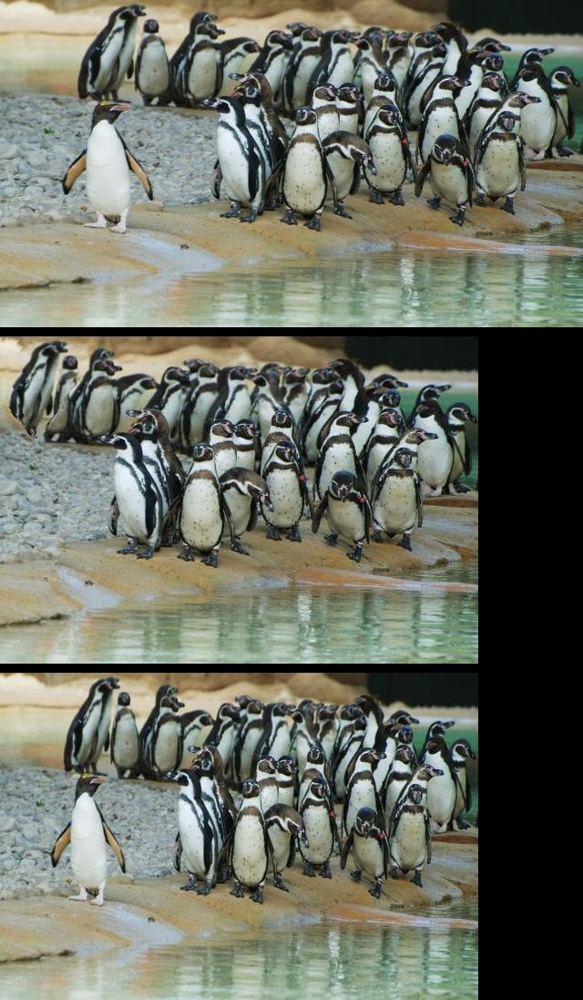

# computer_vision

An implementation in Golang of the algorithm presented in this paper: https://perso.crans.org/frenoy/matlab2012/seamcarving.pdf

The tool has the following commands:

1. Delete X width and Y height pixels from the image while keeping the most interesting content
2. Inserting X width and Y height pixels in the image
3. Amplification of the content with a factor of +x%
4. Delete any convex poly line in the received image

For more details, just run the tool and the cobra command will provide a description for all the available commands.

